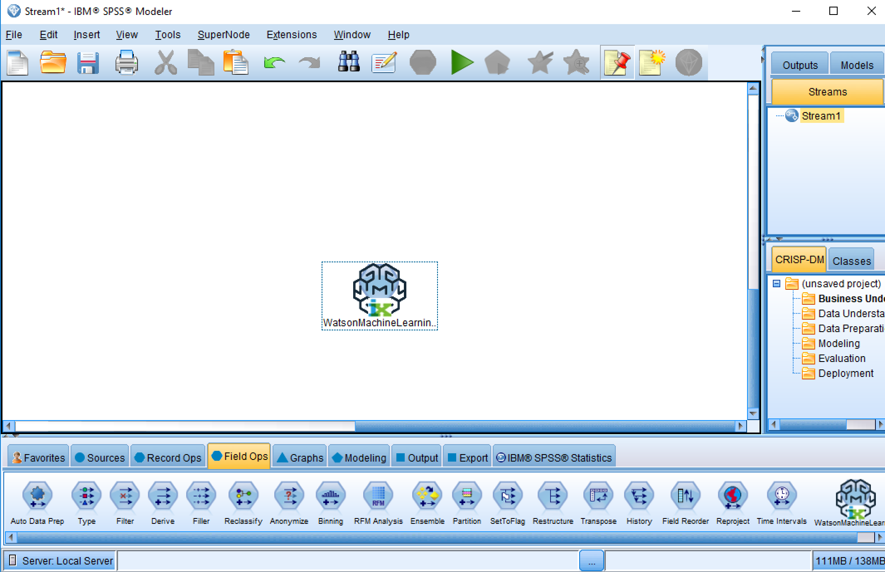
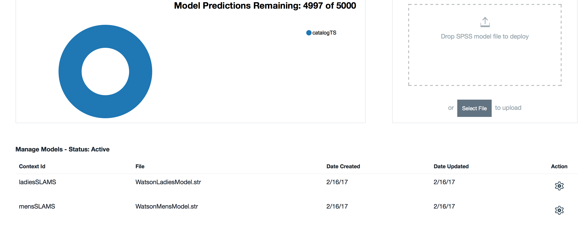
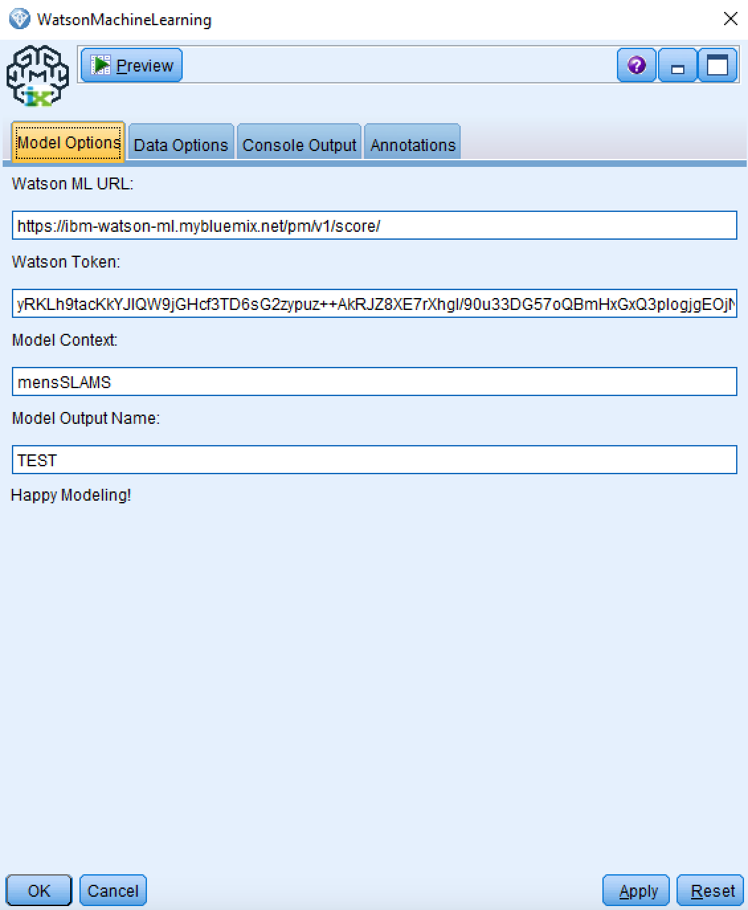
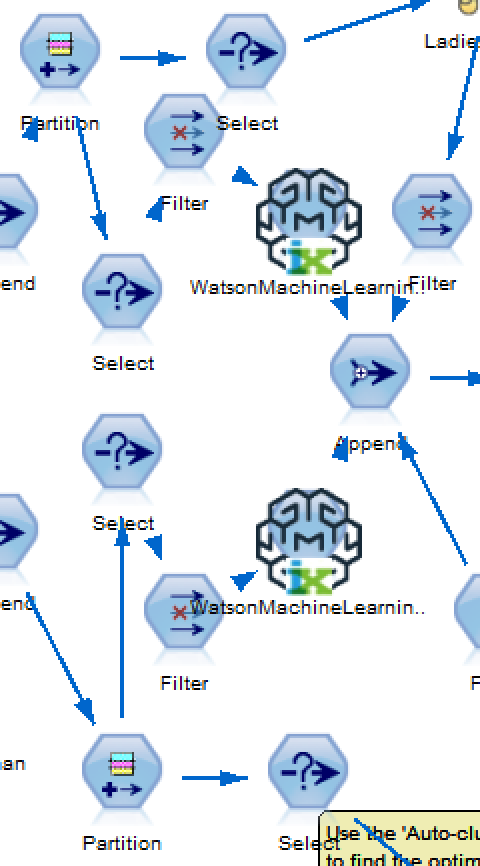

# Watson Machine Learning with the Bluemix Service

The Watson Machine Learning is a custom node for linking SPSS Modeler streams to machine learning models that have been deployed on Bluemix.

---
## Authors
-  Aaron Baughman [(mail)](baaron@us.ibm.com)

---
## Configure Watson Machine Learning
This extension is dependent on:
- R 3.2.x
- Bluemix Watson Machine Learning Service
- Deployed model on Bluemix Watson Machine Learning Service

---
## Requirements
- R package jsonlite
- R package httr
- R package xml2
- IBM SPSS Modeler v18

---
## Parameters

The following parameters must be included.

- Watson ML URL: The base url to the Bluemix Watson Machine Learning service
- Watson Token: The access token for the Bluemix Watson Machine Learning service
- Watson Context: The model name or context

---
## License

[Apache 2.0][1]

---
## Example Stream

[1]:http://www.apache.org/licenses/LICENSE-2.0.html
[2]:https://developer.ibm.com/predictiveanalytics/downloads/#tab2
